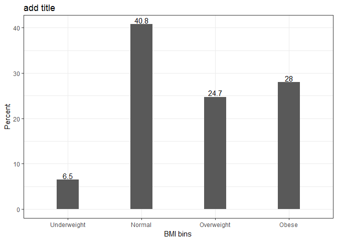
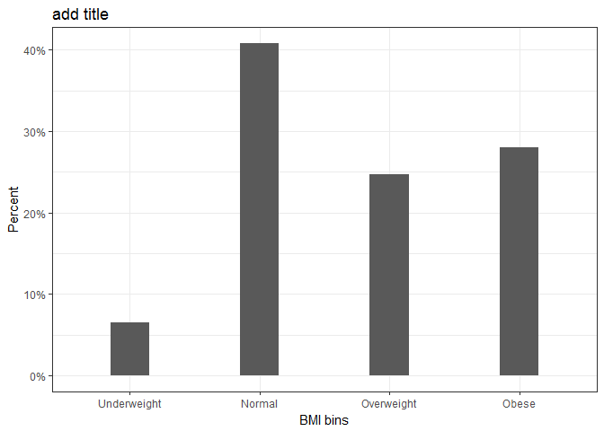
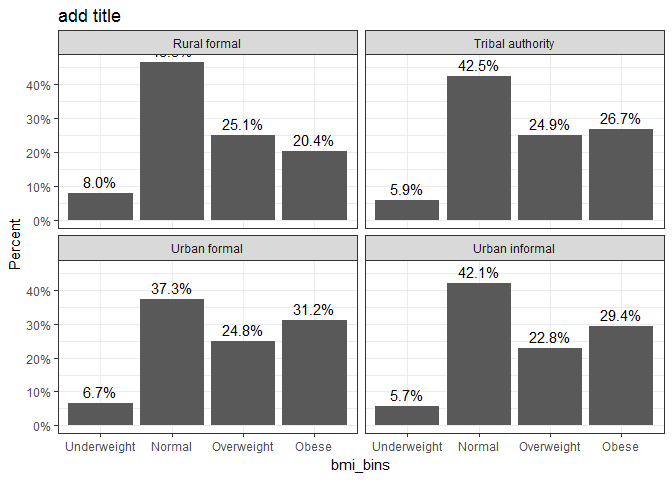
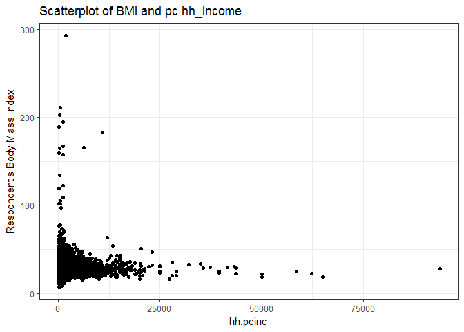
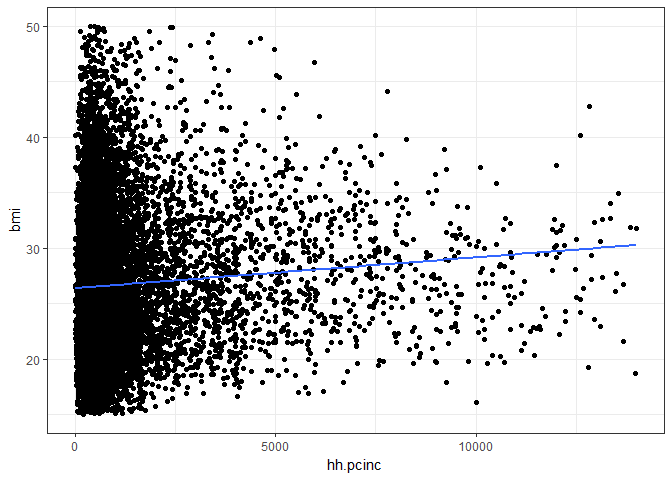
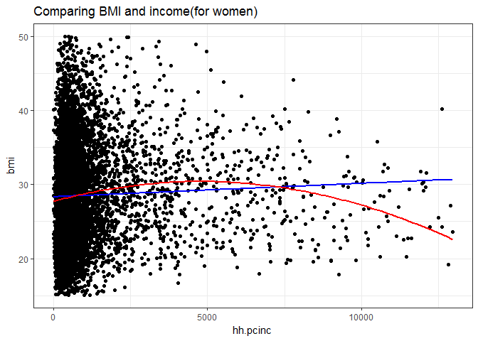
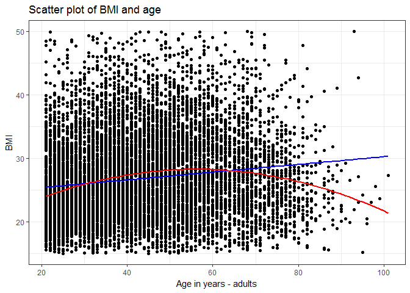
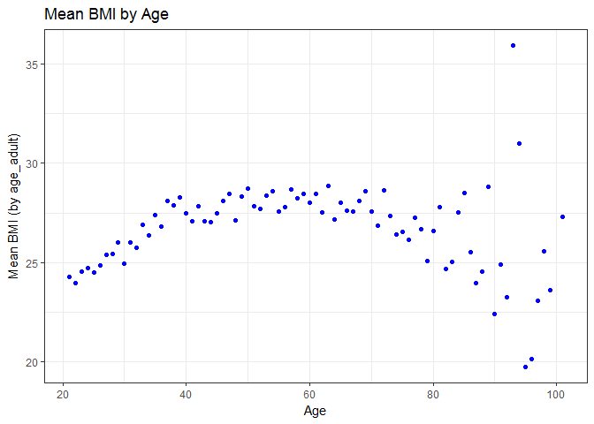
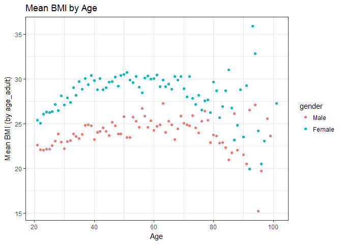
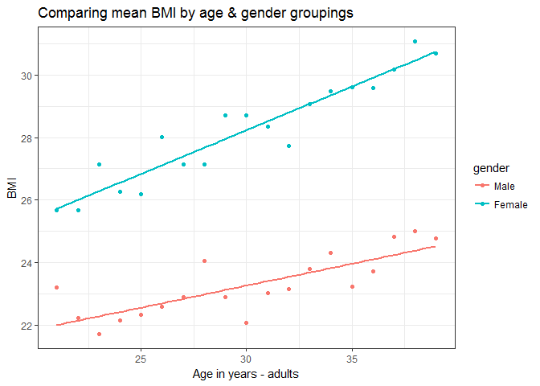

**Note:** *This exercise is part of re-writing the [SALDRU Stata
course](http://www.saldru.uct.ac.za/courses/) in R for
[DataFirst](https://www.datafirst.uct.ac.za/).Therefore, all
descriptions, interpretation and logical approach comes from the
original course and all I did is to write the R code.*

Introduction
============

In this exercise, we follow the BMI examples in the [SALDRU Stata
course](http://www.saldru.uct.ac.za/courses/). The exercise investigate
determinants of BMI and in doing so address the following questions.
What happens to your BMI as you get older? Do richer people have a
higher or lower BMI than middle income or poor people? Is the average
BMI different across racial groups?

We use a subset of the data with the following variables:

`hhid` - "Household identifier"

`pid` - "Individual identifier"

`w1_hhgeo` - "Geo-type""

`w1_hhsizer` - "Number of household residents"

`w1_hhincome` - "Household monthly income - full imputations"

`w1_a_best_age_yrs` - "Best age in years"

`w1_a_b2` - "Gender"

`w1_a_n1_1` - "Height measure one"

`w1_a_n2_1` - "Weight measure one"

`w1_best_race` - "Best race"

`w1_quest_typ` "Questionnaire type (adult, child, proxy)"

Worked example 1: Investigating BMI in South Africa
===================================================

### Import data into R workspace

The data file is in csv format and we use the `read.csv` function to
import the data.

    nids<-read.csv("./data/nids.csv")

### Inspection

We start by having a look at the variables. We are going to use the
`head()` and `tail()` functions to list the first 10 and last 10
observations respectively.

    head(nids, n = 10L)

    ##      hhid    pid w1_hhgeo w1_hhsizer w1_hhincome w1_a_best_age_yrs w1_a_b2
    ## 1  103034 301011        3          3    2844.294                -9      NA
    ## 2  103037 301012        3          3   11367.377                66       2
    ## 3  103037 301013        3          3   11367.377                26       1
    ## 4  103037 301014        3          3   11367.377                78       2
    ## 5  103050 301015        3          3   15400.000                46       2
    ## 6  103046 301016        3          4    5277.933                -9      NA
    ## 7  103046 301017        3          4    5277.933                -9      NA
    ## 8  103049 301018        3          4    5096.404                52       2
    ## 9  103049 301019        3          4    5096.404                25       2
    ## 10 103049 301020        3          4    5096.404                80       1
    ##    w1_a_n1_1 w1_a_n2_1 w1_quest_typ w1_best_race
    ## 1         NA        NA            1            4
    ## 2        162      72.7            1            4
    ## 3        161      62.0            1            4
    ## 4        156      75.2            1            4
    ## 5        170     108.0            1            4
    ## 6         NA        NA            1            4
    ## 7         NA        NA            1            4
    ## 8        161     107.0            1            4
    ## 9         -8      -8.0            1            4
    ## 10        -8      -8.0            1            4

    tail(nids, n = 10L)

    ##         hhid pid w1_hhgeo w1_hhsizer w1_hhincome w1_a_best_age_yrs w1_a_b2
    ## 31161 107305  NA        2          5   1088.4885                NA      NA
    ## 31162 101523  NA        2          3   2559.7656                NA      NA
    ## 31163 102595  NA        2          1  14385.0680                NA      NA
    ## 31164 104102  NA        2          6   2175.4766                NA      NA
    ## 31165 105648  NA        3          3   4771.6035                NA      NA
    ## 31166 103699  NA        2          1   5100.0000                NA      NA
    ## 31167 102647  NA        3          1    600.0000                NA      NA
    ## 31168 101684  NA        3          4   6300.6846                NA      NA
    ## 31169 111168  NA        3          3    582.8772                NA      NA
    ## 31170 104193  NA        2          6   1297.5859                NA      NA
    ##       w1_a_n1_1 w1_a_n2_1 w1_quest_typ w1_best_race
    ## 31161        NA        NA           NA           NA
    ## 31162        NA        NA           NA           NA
    ## 31163        NA        NA           NA           NA
    ## 31164        NA        NA           NA           NA
    ## 31165        NA        NA           NA           NA
    ## 31166        NA        NA           NA           NA
    ## 31167        NA        NA           NA           NA
    ## 31168        NA        NA           NA           NA
    ## 31169        NA        NA           NA           NA
    ## 31170        NA        NA           NA           NA

### New height variable in metres and for respondents aged 20 years and above

In the above exercise, we can notice that the height is measured in
centimeters? In order to calculate BMI, we will need height in metres.
Also, since BMI is a ratio of weight to height squared, we will not want
to include the negative nonresponse height or weight values. Lastly, BMI
is only valid for people over the age of 20 years of age. Let’s create a
new height variable in a more useful form for our purposes. We use the
`dplyr` package for most of our data manipulation. Let's load the
package and create a new height variable.

    library(dplyr)

    nids<-nids %>%
      mutate(height = ifelse (w1_a_n1_1 >= 0 & w1_a_best_age_yrs >= 20, w1_a_n1_1/100, NA))

We can summarise our new variable and start answering some questions.
What is the height of the tallest person in our sample? What is the mean
height of the sample?

    summary(nids$height)

    ##    Min. 1st Qu.  Median    Mean 3rd Qu.    Max.    NA's 
    ##   0.453   1.553   1.610   1.614   1.680   2.074   19718

We can see that the range is \[0.453, 2.074\], which tells us that the
shortest person in the sample has a reported height of less than half a
metre, while the tallest person is 2.07 metres tall. The average height
in the sample is 1.61 metres. We can get an idea of the distribution of
heights in the sample by looking at the percentiles. Half the people in
the sample are between 1.55 and 1.68 metres tall.

Returning to the shortest person in the population, recall that we have
restricted the height variable to only include individuals over the age
of 20. This means that a person who is 0.453 metres tall is either
exceptionally short or that there was an error made in measurement or
data capturing. Let’s investigate people who have reported heights that
are below 'normal'.

How many are there in the sample?

    nids %>% 
      filter(height<1) %>%
      count

    ## # A tibble: 1 × 1
    ##       n
    ##   <int>
    ## 1    28

We see there are 28 people who are shorter than one meter tall in the
sample. Since they are relatively few, We can also list/print the gender
(`w1_a_b2`) and age of these individuals to give us more information to
potentially identify a pattern.Here gender (`w1_a_b2`) is 1 for male and
2 for female.

    nids %>% 
      filter(height<1) %>%
      select(w1_a_best_age_yrs, w1_a_b2, height) %>%
      print()

    ##    w1_a_best_age_yrs w1_a_b2 height
    ## 1                 22       2  0.637
    ## 2                 41       2  0.542
    ## 3                 48       2  0.994
    ## 4                 43       2  0.639
    ## 5                 50       1  0.704
    ## 6                 49       2  0.453
    ## 7                 49       1  0.668
    ## 8                 22       2  0.966
    ## 9                 23       2  0.552
    ## 10                26       2  0.585
    ## 11                40       1  0.610
    ## 12                26       2  0.641
    ## 13                75       1  0.790
    ## 14                57       2  0.771
    ## 15                64       1  0.557
    ## 16                64       2  0.700
    ## 17                74       1  0.725
    ## 18                36       2  0.624
    ## 19                34       2  0.710
    ## 20                50       2  0.847
    ## 21                75       2  0.682
    ## 22                50       1  0.622
    ## 23                38       2  0.615
    ## 24                34       1  0.654
    ## 25                57       2  0.610
    ## 26                30       2  0.642
    ## 27                79       2  0.527
    ## 28                21       2  0.984

There does not appear to be a relationship with age. However, we see
that the majority of individuals under one metre are females.

### New weight variable for respondents aged 20 years and above

We perform the same exercise as above to generate a `weight` variable
for 20+ year olds.

    nids<-nids %>%
      mutate(weight = ifelse (w1_a_n2_1 >= 0 & w1_a_best_age_yrs > 20, w1_a_n2_1, NA)) 

**Note:** *Here I use `w1_a_best_age_yrs > 20` to mimic the Stata course
but it should `be w1_a_best_age_yrs >= 20`.*

    summary(nids$weight)

    ##    Min. 1st Qu.  Median    Mean 3rd Qu.    Max.    NA's 
    ##   19.20   57.50   67.20   69.92   80.00  150.00   20260

Generating a variable for BMI
-----------------------------

The BMI is calculated by dividing weight (kg) by height squared
(*m*2) for people over the age of 20 (i.e.
$BMI=\\frac{weight}{height2}$)

    nids<-nids %>%
      mutate(bmi = weight/height^2)

Some points to note. Firstly, our `bmi` variable should have a missing
value for individuals who are younger than 20 since both our `height`
and `weight` variables are missing for these individuals. We will be
ignoring them when we look at BMI in this course as calculating the BMI
for individuals under the age of 20 involves a different formula.

It is always good to get a sense of what your new variable looks like.
Have we coded it correctly? Does it contain the information we want it
to contain? Is the variable missing for those who should not have a
value and valid for those who should get a value?

Check that BMI is missing for people under age 20 and for those who have
missing height forweight values.

    nids %>% 
      filter(w1_a_best_age_yrs<20 & !is.na(bmi)) %>%
      count

    ## # A tibble: 1 × 1
    ##       n
    ##   <int>
    ## 1     0

    nids %>% 
      filter((is.na(height) | is.na(weight)) & !is.na(bmi)) %>%
      count

    ## # A tibble: 1 × 1
    ##       n
    ##   <int>
    ## 1     0

How many respondents have non-missing BMI values?

    nids %>%
      filter(!is.na(bmi)) %>%
      count

    ## # A tibble: 1 × 1
    ##       n
    ##   <int>
    ## 1 10874

The World Health Organisation classifies a BMI under 18.5 as
underweight, a BMI between 18.5 and 24.9 as normal, a BMI between 25 and
29.9 as overweight and a BMI of 30 or more as obese. In light of this,
does our new variable appear to be reasonable?

### More new variables

Before we proceed to answer more questions, we first generate some new
variables.

#### Age bins

Here we create age bins, i.e. age bin is 1 for ages between 20 and 29, 2
for ages 30 - 39, e.t.c

    nids$age_bins<-NA
    nids$age_bins[nids$w1_a_best_age_yrs>=20 & nids$w1_a_best_age_yrs<=29]<-1
    nids$age_bins[nids$w1_a_best_age_yrs>29 & nids$w1_a_best_age_yrs<=39]<-2
    nids$age_bins[nids$w1_a_best_age_yrs>39 & nids$w1_a_best_age_yrs<=49]<-3
    nids$age_bins[nids$w1_a_best_age_yrs>49 & nids$w1_a_best_age_yrs<=59]<-4
    nids$age_bins[nids$w1_a_best_age_yrs>59 & nids$w1_a_best_age_yrs<=69]<-5
    nids$age_bins[nids$w1_a_best_age_yrs>69 & nids$w1_a_best_age_yrs<=120]<-6

Making `age_bins` a factor variable with labels

    nids$age_bins <- factor(nids$age_bins, levels = 1:6, labels = c("20 - 29 yrs","30 - 39 yrs", "40 - 49 yrs", "50 - 59 yrs", "60 - 69 yrs", "70 - 120 yrs"))

Inspect our age bins

    nids%>%
      group_by(age_bins)%>%
      summarise(freq = n())

    ## # A tibble: 7 × 2
    ##       age_bins  freq
    ##         <fctr> <int>
    ## 1  20 - 29 yrs  3999
    ## 2  30 - 39 yrs  2921
    ## 3  40 - 49 yrs  2553
    ## 4  50 - 59 yrs  2018
    ## 5  60 - 69 yrs  1299
    ## 6 70 - 120 yrs   955
    ## 7           NA 17425

#### Gender variable

Creating a new factor variable for gender.

    nids<-nids%>%
      mutate(gender = factor(w1_a_b2, levels=1:2, labels = c("Male", "Female")))

#### Race variable

    nids$race = factor(nids$w1_best_race, levels = 1:4, labels = c("African", "Coloured","Asian", "White"))

#### Geotype variable

    nids$geotype = factor(nids$w1_hhgeo, levels = 1:4, labels = c("Rural formal", "Tribal authority","Urban formal", "Urban informal"))

Back to Investigating BMI in South Africa
-----------------------------------------

    summary(nids$bmi)

    ##    Min. 1st Qu.  Median    Mean 3rd Qu.    Max.    NA's 
    ##   6.762  21.700  25.480  27.190  30.960 292.700   20296

The average BMI in the sample is 27.2, which indicates that the average
adult in the sample is a little overweight.

We also see that the largest and smallest BMI values are 292.7 and 6.76
respectively. The vast majority of respondents, however, have a BMI
between 15 and 50. How many people have values outside the range?

Using `dplyr`:

    nids%>%
      filter(bmi < 15 | (bmi > 50 & !is.na(bmi)))%>%
      nrow

    ## [1] 240

Or using R base functions:

    nrow(subset(nids, bmi < 15 | (bmi > 50 & !is.na(bmi))))

    ## [1] 240

Let us inspect the height and weight variables for these extreme BMI
values.

    nids%>%
      select(weight, height, bmi)%>%
      filter(bmi < 15 | bmi > 50)%>%
      head(10)

    ##    weight height       bmi
    ## 1    50.0  1.860  14.45254
    ## 2   137.0  1.630  51.56385
    ## 3    45.2  1.802  13.91967
    ## 4   128.3  1.573  51.85244
    ## 5    41.7  1.684  14.70455
    ## 6    28.1  1.595  11.04549
    ## 7    48.4  0.637 119.27969
    ## 8   129.8  1.586  51.60221
    ## 9    59.4  0.542 202.20313
    ## 10   36.0  1.620  13.71742

Do they seem realistic to you? Remember that when dealing with the BMI
variable, we are only considering adults over the age of 20. It might be
appropriate to restrict our sample to people who have BMI values between
15 and 50 and define anyone with a BMI value outside this range as an
outlier. This will be important if we want to exclude outliers from our
analysis.

Does the exclusion of the outliers change the mean significantly?

    summary(nids$bmi)

    ##    Min. 1st Qu.  Median    Mean 3rd Qu.    Max.    NA's 
    ##   6.762  21.700  25.480  27.190  30.960 292.700   20296

    summary(nids[nids$bmi >15 & nids$bmi < 50,c("bmi")])

    ##    Min. 1st Qu.  Median    Mean 3rd Qu.    Max.    NA's 
    ##   15.01   21.74   25.45   26.75   30.78   49.98   20296

Removing outliers reduces the arithmetic mean by over 0.44 from 27.19 to
26.75. In doing a research project, one should always be extremely
careful before removing outliers and make sure that the decision is
justified. Here, it goes beyond the scope of the course to fully
investigate whether the outliers are valid or not. Therefore, we will
ignore outliers from now on even though we have not presented a strong
case for doing so.

    nids<-nids%>%
      mutate(bmi_valid = ifelse(bmi > 15 & bmi < 50,1,NA))

Since BMI is a continuous variable, if we want to use a pie graph to get
a general picture of the data, we need to divide the respondents into
BMI categories. Let’s use the WHO categories described above and below,
we give the code to generate BMI categories.

    nids$bmi_bins_nolabel<-NA
    nids$bmi_bins_nolabel[which(nids$bmi>=15 & nids$bmi<18.5)]<-1
    nids$bmi_bins_nolabel[which(nids$bmi>=18.5 & nids$bmi<25)]<-2
    nids$bmi_bins_nolabel[which(nids$bmi>=25 & nids$bmi<30)]<-3
    nids$bmi_bins_nolabel[which(nids$bmi>=30 & nids$bmi<=50)]<-4

The code above only recoded those BMI values between 15 and 50. We saw
that 240 adults have values outside this range and we want to classify
these as outliers and change them to missing values in our recoded
bmi\_bins\_nolabel variable.

To generate another new variable, but with labels, simply type;

    nids$bmi_bins<-factor(nids$bmi_bins_nolabel, levels=1:4, labels = c("Underweight","Normal", "Overweight", "Obese"))

Check that the variable looks correct.

    nids%>%
      select(bmi, bmi_bins_nolabel, bmi_bins)%>%
      head(15)

    ##         bmi bmi_bins_nolabel   bmi_bins
    ## 1        NA               NA       <NA>
    ## 2  27.70157                3 Overweight
    ## 3  23.91883                2     Normal
    ## 4  30.90072                4      Obese
    ## 5  37.37024                4      Obese
    ## 6        NA               NA       <NA>
    ## 7        NA               NA       <NA>
    ## 8  41.27927                4      Obese
    ## 9        NA               NA       <NA>
    ## 10       NA               NA       <NA>
    ## 11       NA               NA       <NA>
    ## 12       NA               NA       <NA>
    ## 13       NA               NA       <NA>
    ## 14       NA               NA       <NA>
    ## 15 19.21875                2     Normal

**3. What proportion of the adult sample is obese? What proportion of
adults in the sample has a missing BMI value? How many of these were
outliers that we recoded to be missing due to having an extreme BMI
value?**

    nids%>%
      filter(w1_a_best_age_yrs>=20)%>%
      group_by(bmi_bins)%>%
      summarise(freq=n())%>%
      mutate(pct = freq/sum(freq)*100)

    ## # A tibble: 5 × 3
    ##      bmi_bins  freq       pct
    ##        <fctr> <int>     <dbl>
    ## 1 Underweight   689  5.012732
    ## 2      Normal  4338 31.560567
    ## 3  Overweight  2629 19.126955
    ## 4       Obese  2978 21.666060
    ## 5          NA  3111 22.633685

or

    nids%>%
      filter(w1_a_best_age_yrs>=20)%>%
      count(bmi_bins)%>%
      mutate(freq = n/sum(n)*100)

    ## # A tibble: 5 × 3
    ##      bmi_bins     n      freq
    ##        <fctr> <int>     <dbl>
    ## 1 Underweight   689  5.012732
    ## 2      Normal  4338 31.560567
    ## 3  Overweight  2629 19.126955
    ## 4       Obese  2978 21.666060
    ## 5          NA  3111 22.633685

**Answers:**

21.7% of the adult population is obese and 22.6% (3111) of the adult
population have a missing bmi value

    nids%>%
      filter(!is.na(bmi) & is.na(bmi_bins_nolabel))%>%
      count

    ## # A tibble: 1 × 1
    ##       n
    ##   <int>
    ## 1   240

240 were outliers recoded to be missing

**4. First use a pie graph to graphically depict the BMI distribution in
our sample. Now see if you can compare the BMI of individuals both by
gender and by whether they reside in an urban or rural area. Include
percentages to indicate the size of each of the slices of the pies. Are
there bigger differences between the BMI distribution for men and women
or between rural and urban areas?**

    library(ggplot2)
    library(scales)

    nids%>%
      filter(!is.na(bmi_bins))%>%
      count(bmi_bins)%>%
      mutate(freq = n/sum(n)*100)%>%
      ggplot(., aes(x = bmi_bins, y = freq)) + 
      geom_bar(stat = "identity", width=.3) + 
      theme_minimal() +
      geom_text(aes(label=round(freq,1)), vjust=-0.2) +
      xlab("BMI bins") + ylab("Percent")

Or

    nids%>%
      filter(!is.na(bmi_bins))%>%
      ggplot(., aes(bmi_bins)) +
      geom_bar(aes(y = (..count..)/sum(..count..)), width=.3) +
      scale_y_continuous(labels=scales::percent) + 
      theme_minimal() +
      xlab("BMI bins") + ylab("Percent")

**By gender:**

    nids%>%
      filter(!is.na(bmi_bins))%>%
      ggplot(., aes(x= bmi_bins,  group=gender)) + 
        geom_bar(aes(y = ..prop..), stat="count") +
        geom_text(aes( label = scales::percent(..prop..),
                       y= ..prop.. ), stat= "count", vjust = -.5) +
        theme_minimal() +
        labs(y = "Percent") +
        facet_grid(~gender) +
        scale_y_continuous(labels = scales::percent) 

**By geotype:**

    nids%>%
      filter(!is.na(bmi_bins))%>%
      ggplot(., aes(x= bmi_bins,  group=geotype)) + 
        geom_bar(aes(y = ..prop..), stat="count") +
        geom_text(aes( label = scales::percent(..prop..),
                       y= ..prop.. ), stat= "count", vjust = -.5) +
        labs(y = "Percent") +
        facet_wrap(~geotype, ncol = 2) +
        scale_y_continuous(labels = scales::percent) + 
      theme_minimal()

**Bonus Question: See whether you can graphically examine the
relationship between BMI and age and gender in a single graph.**

So far we have used some graphs to gain a better picture of our BMI
variable and how it relates to gender, age and an urban/rural living
environment. Graphs are often good first getting a first overview of a
relationship. But we can also use descriptive statistics disaggregated
by different demographic characteristics to give us an even better
understanding of BMI.

Let us compare the mean BMI of different racial groups.

    by(nids[,c("bmi")], nids$race, summary)

    ## nids$race: African
    ##    Min. 1st Qu.  Median    Mean 3rd Qu.    Max.    NA's 
    ##   6.762  21.710  25.380  27.160  30.890 202.200   13625 
    ## -------------------------------------------------------- 
    ## nids$race: Coloured
    ##    Min. 1st Qu.  Median    Mean 3rd Qu.    Max.    NA's 
    ##   10.62   20.66   25.02   27.00   31.32  292.70    2586 
    ## -------------------------------------------------------- 
    ## nids$race: Asian
    ##    Min. 1st Qu.  Median    Mean 3rd Qu.    Max.    NA's 
    ##   16.11   22.95   25.97   26.63   30.34   44.14     290 
    ## -------------------------------------------------------- 
    ## nids$race: White
    ##    Min. 1st Qu.  Median    Mean 3rd Qu.    Max.    NA's 
    ##   14.45   24.11   27.64   28.21   31.40   63.18     829

This shows that on average Whites have a higher BMI than the other
racial categories. We can also see from the standard deviations that
there is far more variation in the BMI values in the African and
Coloured groups. The minimum value in the African group is 6.8; the
maximum value is 202 and the standard deviation around 9. This compares
with a minimum and maximum of 14.5 and 63 respectively, and a standard
deviation of 5.8 in the White group. Why would Whites have the highest
BMI on average? One reason could be to do with differences in the age
distributions between racial groups. How does BMI vary with age?

    nids%>%
      group_by(age_bins)%>%
      summarise(Mean=mean(bmi, na.rm=TRUE),
           Std.Dev=sd(bmi, na.rm=TRUE), 
           Min=min(bmi, na.rm=TRUE),
           Max=max(bmi, na.rm=TRUE))

    ## # A tibble: 7 × 5
    ##       age_bins     Mean   Std.Dev       Min      Max
    ##         <fctr>    <dbl>     <dbl>     <dbl>    <dbl>
    ## 1  20 - 29 yrs 25.12003  8.241904  6.762409 194.6088
    ## 2  30 - 39 yrs 27.21916  9.572260 11.606678 211.2499
    ## 3  40 - 49 yrs 28.15660  9.817091  7.076765 202.2031
    ## 4  50 - 59 yrs 28.44804  8.344429  9.904263 109.1571
    ## 5  60 - 69 yrs 28.46623  8.498549 13.443787 122.4490
    ## 6 70 - 120 yrs 27.67025 13.258297  8.624174 292.7314
    ## 7           NA      NaN       NaN        NA       NA

BMI increases with age in the first four categories and then stabilizes,
before declining when individuals reach old age. Note also that for all
age group categories the average BMI is in the overweight category.
Notice also that BMI tends to be higher in older age categories. This
means that if the White group has, on average, more people in the older
age categories than other racial groups, this might contribute to the
higher average White BMI value. Let’s look at the age distributions
across racial groups.

    nids<-nids%>%
      mutate(age_adult = ifelse(w1_a_best_age_yrs<0,NA, w1_a_best_age_yrs))

    nids%>%
      filter(!is.na(race))%>%
      ggplot(., aes(x=age_adult)) +
       geom_histogram( aes(y = ..density..), binwidth = 1) +
       facet_wrap(~race) + 
      theme_minimal() +
       xlab("Age in years - adults") + ylab("Density")

    ## Warning: Removed 11605 rows containing non-finite values (stat_bin).

There are differences in the age profiles across racial groups. The
African and Coloured groups are weighted quite heavily towards younger
adults, while the White group appears to have a more equal number of
people across all ages.

Thus a better comparison of BMI across racial groups should take into
consideration the differences in the age profile.

Worked example 2: Assessing the impact of per capita income on BMI
==================================================================

In this worked example we aim to assess how BMI varies with income. Are
rich people more likely to be obese than people with lower incomes? They
have more money to spend on food, but can also afford a healthy diet and
to buy gym memberships. By now we are reasonably well acquainted with
the BMI variable, but we need to find a variable which gives us an
indication of how rich (well-off) the person is.

With such a wide variety of income variables, we need to decide which
one will be the most appropriate to investigate the relationship between
BMI and income. Should we use the amount of income that an individual
earns or the total income of the household?

Individual income does not take into consideration that families
generally pool/share their income. Individual income would assign all
people who do not work, receive grants or transfers, zero income. This
is not what we want; we need a variable which reflects the level of
resources available to the individual. Total household income
(`w1_hhincome`) would give an indication of the wealth of the household,
but we need to take into consideration the number of household members
who will share this income.

We could just divide the total household income by the household size
variable to create a per capita household income variable. But it may be
more accurate to weight children less than adults since they generally
consume a smaller proportion of household resources (and hence household
income) than adults. For example, consider two households each with a
total monthly income of R2 000, but one household consists of four
adults and the other of two adults and two young children. If we assume
for simplicity that all income is spent on food, we would expect that
the adults in the household consisting of two adults and two children
will have access to more food than the adults in the four adult
household.

Let’s assume that children under 15 use half the household resources
used by those 15 years or older. We therefore need to calculate the
number of household members under 15 and the number of members over 15
in the household. To do this, we create a variable that assigns to every
member of the household, a value equal to the number of children under
the age of 15 in the household.

    nids$child.dummy<-0
    nids$child.dummy[nids$w1_quest_typ == 2]<-1

    table(nids$child.dummy)

    ## 
    ##     0     1 
    ## 21554  9616

The code above creates a variable that assigns to every member of the
household, the number of individuals over the age of 15. However, it is
worth noticing that we used the questionnaire type answered by the
individual as an indicator for their age as individuals under 15 were
meant to answer the child questionnaire, while those over 15 were meant
to have an adult or proxy questionnaire. However, there are several
borderline cases (around 15 years old) which answered the wrong
questionnaire. This isn’t too worrying for us in this instance though.

Let’s generate a variable that contains the number of adults in a
household.

    nids<-nids%>%
      group_by(hhid)%>%
      mutate(hh.children=sum(child.dummy, na.rm=TRUE))%>%
      mutate(hh.adults = w1_hhsizer- hh.children)

Check to see that the variables give us the number of children and
adults in the household.

    nids%>%
      select(hhid, pid, w1_hhsizer, w1_hhincome, child.dummy, bmi, gender,bmi_valid)%>%
      head()

    ## Source: local data frame [6 x 8]
    ## Groups: hhid [4]
    ## 
    ##     hhid    pid w1_hhsizer w1_hhincome child.dummy      bmi gender
    ##    <int>  <int>      <int>       <dbl>       <dbl>    <dbl> <fctr>
    ## 1 103034 301011          3    2844.294           0       NA     NA
    ## 2 103037 301012          3   11367.377           0 27.70157 Female
    ## 3 103037 301013          3   11367.377           0 23.91883   Male
    ## 4 103037 301014          3   11367.377           0 30.90072 Female
    ## 5 103050 301015          3   15400.000           0 37.37024 Female
    ## 6 103046 301016          4    5277.933           0       NA     NA
    ## # ... with 1 more variables: bmi_valid <dbl>

Now we can create our adult equivalent household size variable, where
children count 0.5 of the amount that adults do. While this is crude, it
is sufficient for our purposes.

    nids<-nids%>%
      mutate(hhsize.adultequiv=hh.adults + 0.5*hh.children)

Finally create the household per capita adult equivalent income
variable. While this sounds complicated, this is just a variable that
gives us per capita income in every household, adjusting for the number
of children in the household. It is a household level per capita income
variable.

    nids<-nids%>%
      mutate(hh.pcinc=w1_hhincome/hhsize.adultequiv)

Notice that the fourth column is simply equal to the second column
divided by the third. What is the difference between the first and third
columns? We now have an income variable which reflects the household
income available to each individual and can proceed to assess the impact
of financial wellbeing on BMI.

Recall that when we are dealing with BMI, we want to restrict our sample
to adults over 20, but since we have calculated our BMI variable in such
a way that it only has values for people over the age of 20, we will
often not need to restrict our sample explicitly. We should however
always be careful that we are indeed only working with a sample that
includes individuals over the age of 20.

Since BMI and income are both continuous variables it is easiest to
summarize the relationship between them using a scatter graph.

    ggplot(nids, aes(hh.pcinc, bmi)) +
      geom_point() + 
      theme_minimal() +
      ggtitle("Scatterplot of BMI and pc hh_income") +
      ylab("Respondent's Body Mass Index")

    ## Warning: Removed 20296 rows containing missing values (geom_point).

It is clear from the scatterplot that there are very large outliers on
both dimensions (income and BMI). While the majority of the sample has
BMI values below 100 and hh.pcinc values under 30000, there are a few
extremely large BMI and income values. Do you think it is possible for
someone to have a BMI of over 150? What height and weight combination
would such an individual need to have? Check to see how tall and heavy
the individuals with BMI greater than 150 in the sample are. While,
these may be possible combinations, it seems more likely that at least
some of them are errors.

In order to make the graph more useful, we should restrict the range of
both BMI and income. Here, we will use the range \[15, 50\] for BMI as
we did previously and \[0, 14 000\] for income, since 99% of the sample
falls below this income level. Check this.

Redraw the scatterplot restricting the range of BMI and income as
suggested and adding a trend line.

    ggplot(nids[nids$bmi_valid == 1 & nids$hh.pcinc <= 14000,], aes(hh.pcinc, bmi)) +
      geom_point() + 
      theme_minimal() +
      stat_smooth(method = "lm", size=1, formula = y ~ x, se = FALSE)

    ## Warning: Removed 20386 rows containing non-finite values (stat_smooth).

    ## Warning: Removed 20386 rows containing missing values (geom_point).

This graph is much clearer than the previous one. What can we say about
the relationship between BMI and income from this graph?

The graph shows that the relationship between BMI and income is
positive. As income increases, BMI increases. We see that at low income
levels there are far more observations than at higher income levels and
that the scatter is also more dispersed.

Recall that there are stark differences in mean BMI between men and
women. In light of this, alter the graph to give a more complete picture
of the relationship between BMI and income by taking gender into
consideration.

    nids%>%
      filter(bmi_valid == 1 & hh.pcinc <= 14000 & !is.na(gender))%>%
      ggplot(., aes(hh.pcinc, bmi, color = gender)) +
      geom_point() + 
      stat_smooth(method = "lm", size=1, formula = y ~ x, se = FALSE) + 
      theme_minimal() +
      ggtitle("Comparing BMI and income (by gender)") +
      ylab("BMI")

Does this reflect the expected gender differences in BMI? What exactly
is this graph telling us?

The graph shows that the relationship between BMI and income is positive
for both men and women. The trend line for men is, however, steeper than
the trend line for females. This suggests that an increase in income is
associated with a greater increase in BMI for men than for women. In
fact, BMI is fairly constant across all income levels for females.

From the graph it appears that at low income levels, women tend to have
a substantially higher BMI than men. However, at incomes of R10000 the
male and female trend lines cross. Let’s investigate this further.

    nids$inc.cat<-NA
    nids$inc.cat[which(nids$hh.pcinc<2500)]<-1
    nids$inc.cat[which(nids$hh.pcinc>=2500 & nids$hh.pcinc<5000)]<-2
    nids$inc.cat[which(nids$hh.pcinc>=5000 & nids$hh.pcinc<10000)]<-3
    nids$inc.cat[which(nids$hh.pcinc>=10000 & nids$hh.pcinc <=max(nids$hh.pcinc))]<-4

    nids$inc.cat<-factor(nids$inc.cat,
                           levels = 1:4,
                           labels = c("<2500", "250-4999", "5000-9999", "10000+"))

    nids%>%
      filter(!is.na(gender))%>%
      group_by(gender, inc.cat)%>%
      summarise(mbmi = mean(bmi, na.rm=T))

    ## Source: local data frame [8 x 3]
    ## Groups: gender [?]
    ## 
    ##   gender   inc.cat     mbmi
    ##   <fctr>    <fctr>    <dbl>
    ## 1   Male     <2500 23.33890
    ## 2   Male  250-4999 25.97536
    ## 3   Male 5000-9999 28.60379
    ## 4   Male    10000+ 27.57662
    ## 5 Female     <2500 29.07081
    ## 6 Female  250-4999 30.22302
    ## 7 Female 5000-9999 28.91630
    ## 8 Female    10000+ 29.36458

The table shows that the relationship between BMI and income is
non-linear for females; BMI first increases with income and thereafter
decreases. For males the trend is far more linear with only a marginal
decline in BMI at very high income levels.

**What are some of the reasons why the relationship would be
non-linear?**

Let’s add a non-linear trend line to our BMI-income graph and see
whether it picks up the non-linear trend apparent in the table. We
restrict our sample to females only.

    nids%>%
      filter(bmi_valid == 1 & hh.pcinc < 13000 & gender=="Female")%>%
      ggplot(., aes(x = hh.pcinc, y = bmi)) +
      geom_point() +
      stat_smooth(method = "lm", formula = y ~ x, se = FALSE, colour = "blue", aes(colour = "linear")) +
      stat_smooth(method = "lm", formula = y ~ poly(x, 2), se = FALSE, colour = "red") + 
      theme_minimal() +
      ggtitle("Comparing BMI and income(for women)")

The curved non-linear trend supports the findings from our table; female
BMI initially increases with income up until an income level of
approximately R 5000 per month and thereafter it declines.

So far we have investigated the relationships between several variables
using graphical and simple descriptive statistical methods. In the next
module, we will be introduced to using simple regression analysis in R
which will allow us to conduct far more powerful analyses. But before
moving on, use the exercises to revise what you have learnt.

Worked example 3: Is age a strong determinant of BMI?
=====================================================

In the previous examples, we began investigating the relationship
between BMI and age. Recall that BMI is derived from weight and height.
Since height does not change substantially in adulthood, adult BMI
changes as a result of changes in weight. Think about how a person’s
weight changes over their adult life cycle. As a result of this, what
would you expect the relationship between BMI and age to be?

You are probably beginning to realize that when analyzing a relationship
between variables it is useful to start with a hypothesis or set of
hypotheses and then interrogate them. During this process we reject the
hypotheses found to be false and accept or update the others.

What is your hypothesis about the relationship between BMI and age? Do
you think it will be a linear or non-linear relationship? Would you
expect this relationship to be different for men and women?

We restrict the BMI value to exclude people with extreme BMI values and
check the correlation between BMI and age. Note, that we also created a
new variable called `adult_age` in the getting ready section at the
beginning of the module. This variable is essentially exactly the same
as the `w1_a_best_age_yrs` variable except that it has no negative
values and has a slightly less cumbersome name.

We subset the `bmi` and `age_adult` variables and compute the
correlation coeficient.

    corr2.df<-nids[nids$bmi_valid==1,c("bmi","age_adult")]
    cor(corr2.df,use="complete.obs")

    ##                 bmi age_adult
    ## bmi       1.0000000 0.1465733
    ## age_adult 0.1465733 1.0000000

BMI and age are positively correlated. The correlation between BMI and
age is much lower than the correlation found between expenditure and
income seen previously in this module. Why do you think this is? Does
this mean that BMI is not related to age?

A simple scatterplot gives us the relationship between BMI and age over
different values of BMI and age.

    ggplot(corr2.df, aes(x = age_adult, y = bmi)) +
      geom_point(aes(x = age_adult, y = bmi)) +
      stat_smooth(method = "lm", formula = y ~ x, se = FALSE, colour = "red") + 
      stat_smooth(method = "lm", formula = y ~ poly(x, 2), se = FALSE, colour = "green") +
      scale_x_continuous(breaks=seq(20,100,20)) +
      scale_y_continuous(breaks=seq(10,50,10)) + 
      theme_minimal() +
      xlab("Age in years - adults") + ylab("BMI") +
      ggtitle("Scatter plot of BMI and age")

Observing the scatter, the relationship between BMI and age looks
tenuous. However, the trend lines suggest that there is a nonlinear
relationship between BMI and age; BMI increases with age until around
age 50 and decreases thereafter. This means that adult’s weight tends to
increase until they are around 50 and thereafter starts to decrease.
Does this make sense? Let’s investigate this nonlinear trend.

    bmi_age_df<-corr2.df%>%
      group_by(age_adult)%>%
      summarise(bmi_age = mean(bmi, na.rm = T))

This code assigns the mean BMI for individuals of a given age to each
individual of that age. For example, if there are only 3 people of age
30 in the sample with BMI values of 20, 22 and 27, then they will all
get assigned a bmi\_age value of 23 (the mean of the three BMI values).
To see this in the actual sample, browse the following.

    head(bmi_age_df, n=20L)

    ## # A tibble: 20 × 2
    ##    age_adult  bmi_age
    ##        <int>    <dbl>
    ## 1         21 24.29443
    ## 2         22 23.96769
    ## 3         23 24.53928
    ## 4         24 24.70903
    ## 5         25 24.51453
    ## 6         26 24.86776
    ## 7         27 25.39660
    ## 8         28 25.45512
    ## 9         29 26.00374
    ## 10        30 24.94636
    ## 11        31 26.01209
    ## 12        32 25.73011
    ## 13        33 26.91586
    ## 14        34 26.34752
    ## 15        35 27.38341
    ## 16        36 26.83006
    ## 17        37 28.10727
    ## 18        38 27.87143
    ## 19        39 28.26772
    ## 20        40 27.50038

You can then see that all the 21 year olds in the sample were assigned a
bmi\_age value of 24.29. On average, 21 year olds in our sample have a
BMI of 24.29. It will be much more interesting to see how this average
bmi\_age variable changes with age.

We can investigate this by plotting the mean bmi by age variable against
age.

    ggplot(bmi_age_df, aes(x = age_adult, y = bmi_age)) +
      geom_point(aes(x = age_adult, y = bmi_age), colour="blue") +
      theme_minimal() +
      xlab("Age") + ylab("Mean BMI (by age_adult)") +
      ggtitle("Mean BMI by Age")

    ## Warning: Removed 1 rows containing missing values (geom_point).

The nonlinear relationship between BMI and ages emerges clearly. BMI
increases sharply with age between 20 and 40 years of age, stays
relatively stable through the middle ages and then becomes more erratic
at older ages, with a general downward trend. If your hypothesis about
the relationship between BMI and age was that BMI increases with age up
until 60 and thereafter declines, the scatterplot supports your
hypothesis. Part of the reason the relationship is less stable at older
ages is that there are fewer individuals in these older groups.

The relationship between BMI and age might be different for men and
women. How would you go about investigating this?

    nids%>%
      filter(!is.na(gender))%>%
      group_by(gender,age_bins)%>%
      summarise(Mean = mean(bmi, na.rm=TRUE))

    ## Source: local data frame [14 x 3]
    ## Groups: gender [?]
    ## 
    ##    gender     age_bins     Mean
    ##    <fctr>       <fctr>    <dbl>
    ## 1    Male  20 - 29 yrs 22.65384
    ## 2    Male  30 - 39 yrs 23.73937
    ## 3    Male  40 - 49 yrs 24.20031
    ## 4    Male  50 - 59 yrs 25.48373
    ## 5    Male  60 - 69 yrs 25.04924
    ## 6    Male 70 - 120 yrs 25.02713
    ## 7    Male           NA      NaN
    ## 8  Female  20 - 29 yrs 26.77512
    ## 9  Female  30 - 39 yrs 29.44394
    ## 10 Female  40 - 49 yrs 30.46145
    ## 11 Female  50 - 59 yrs 30.12929
    ## 12 Female  60 - 69 yrs 30.42590
    ## 13 Female 70 - 120 yrs 28.97058
    ## 14 Female           NA      NaN

The table suggests that the quadratic relationship between BMI and age
is slightly stronger for females than males. Female mean BMI increases
substantially between the 20s and 30s, increases a little further
between the 30s and 40s, then remains fairly stable between the 40s and
60s and decreases thereafter. Male BMI increases more steadily until the
50s and decreases marginally thereafter. Is this supported when we use
the correlation command?

**• Females: Below 60 years old**

    fb60<-nids[nids$bmi_valid==1 & nids$age_adult < 60 & nids$w1_a_b2 == 2,c("bmi","age_adult")]
    cor(fb60, use="complete.obs")

    ##                 bmi age_adult
    ## bmi       1.0000000 0.2135916
    ## age_adult 0.2135916 1.0000000

**• Females: Over 60 years old**

    fo60<-nids[nids$bmi_valid==1 & nids$age_adult > 60 & nids$w1_a_b2 == 2,c("bmi","age_adult")]
    cor(fo60, use="complete.obs")

    ##                  bmi  age_adult
    ## bmi        1.0000000 -0.1449253
    ## age_adult -0.1449253  1.0000000

**• Males: Below 60 years old**

    mb60<-nids[nids$bmi_valid==1 & nids$age_adult < 60 & nids$w1_a_b2 == 1,c("bmi","age_adult")]
    cor(mb60, use="complete.obs")

    ##                 bmi age_adult
    ## bmi       1.0000000 0.1897421
    ## age_adult 0.1897421 1.0000000

**• Males: Over 60 years old**

    mo60<-nids[nids$bmi_valid==1 & nids$age_adult > 60 & nids$w1_a_b2 == 1,c("bmi","age_adult")]
    cor(mo60, use="complete.obs")

    ##                   bmi   age_adult
    ## bmi        1.00000000 -0.08561469
    ## age_adult -0.08561469  1.00000000

What do these results tell us? They seem to further support the idea
that the relationship between BMI and age is positive for younger adults
and negative over the age of 60. They also suggest that relationship
between age and BMI is stronger for women than men on both the positive
and negative sections of the parabolic relationship.

We now have a fairly good idea of the general relationship between BMI
and age. To gain a more precise understanding of this relationship we
use regression. Regression allows us to quantify the relationship
between the two variables. How large is the influence of age on BMI?

    lm1 <- lm(bmi~age_adult, data = subset(nids,subset=bmi_valid==1))
    summary(lm1)

    ## 
    ## Call:
    ## lm(formula = bmi ~ age_adult, data = subset(nids, subset = bmi_valid == 
    ##     1))
    ## 
    ## Residuals:
    ##     Min      1Q  Median      3Q     Max 
    ## -14.680  -4.791  -1.172   3.899  24.372 
    ## 
    ## Coefficients:
    ##              Estimate Std. Error t value Pr(>|t|)    
    ## (Intercept) 24.160418   0.180727  133.69   <2e-16 ***
    ## age_adult    0.060722   0.003974   15.28   <2e-16 ***
    ## ---
    ## Signif. codes:  0 '***' 0.001 '**' 0.01 '*' 0.05 '.' 0.1 ' ' 1
    ## 
    ## Residual standard error: 6.554 on 10632 degrees of freedom
    ## Multiple R-squared:  0.02148,    Adjusted R-squared:  0.02139 
    ## F-statistic: 233.4 on 1 and 10632 DF,  p-value: < 2.2e-16

What does this tell us? On average, a one year increase in age is
associated with a 0.07 unit increase in BMI.

You will notice that the R-squared value is far lower than the one from
the regression of expenditure on income. Why do you think this is? The
relationship between expenditure and income is well defined - the more
you have, the more you can spend. In general, relationships between
variables are more complex. A low R-squared value just says that age
only explains a small part of the variation in BMI values.
Alternatively, it might be reflecting the fact that by running a
regression we are assuming a linear relationship. As we have seen above,
it is likely that the relationship is in fact non-linear.

Even if we only look at 21 - 40 year olds where we might expect a linear
relationship between BMI and age, it is to be expected that age would
only explain a relatively small part of the variation in BMI, as we
showed that BMI varied between genders, as well as between racial and
income groups and we have not accounted for these characteristics.
Besides these factors, can you think of other factors that would explain
variation in BMI? How about genetics? Education? Exercise? Quality of
diet? We will only be able to account for these other factors when we
move onto including multiple explanatory variables in our regressions in
module 8.

Given what we have learnt from the summary measures about the
relationship between BMI and age, is there any way we can improve on
this regression? As we mentioned above, it is more appropriate to use
regression where there is a linear relationship between the variables.

Therefore, we break our sample into three groups: between 20 and 40
years of age; between 40 and 60 years; and over 60 years. We then
examine the relationship between BMI and age for each group.

    lm2 <- lm(bmi~age_adult, data = subset(nids,subset=age_adult < 40 & bmi_valid==1))
    summary(lm2)

    ## 
    ## Call:
    ## lm(formula = bmi ~ age_adult, data = subset(nids, subset = age_adult < 
    ##     40 & bmi_valid == 1))
    ## 
    ## Residuals:
    ##     Min      1Q  Median      3Q     Max 
    ## -11.946  -4.368  -1.218   3.178  25.745 
    ## 
    ## Coefficients:
    ##             Estimate Std. Error t value Pr(>|t|)    
    ## (Intercept) 19.17872    0.44372   43.22   <2e-16 ***
    ## age_adult    0.22471    0.01497   15.01   <2e-16 ***
    ## ---
    ## Signif. codes:  0 '***' 0.001 '**' 0.01 '*' 0.05 '.' 0.1 ' ' 1
    ## 
    ## Residual standard error: 6.029 on 5197 degrees of freedom
    ## Multiple R-squared:  0.04156,    Adjusted R-squared:  0.04137 
    ## F-statistic: 225.3 on 1 and 5197 DF,  p-value: < 2.2e-16

    lm3 <- lm(bmi~age_adult, data = subset(nids,subset=age_adult >=40 & age_adult <60 & bmi_valid == 1))
    summary(lm3)

    ## 
    ## Call:
    ## lm(formula = bmi ~ age_adult, data = subset(nids, subset = age_adult >= 
    ##     40 & age_adult < 60 & bmi_valid == 1))
    ## 
    ## Residuals:
    ##      Min       1Q   Median       3Q      Max 
    ## -12.8965  -5.3993  -0.8536   4.5254  22.3643 
    ## 
    ## Coefficients:
    ##             Estimate Std. Error t value Pr(>|t|)    
    ## (Intercept) 25.00265    0.99924  25.022   <2e-16 ***
    ## age_adult    0.05834    0.02037   2.864   0.0042 ** 
    ## ---
    ## Signif. codes:  0 '***' 0.001 '**' 0.01 '*' 0.05 '.' 0.1 ' ' 1
    ## 
    ## Residual standard error: 6.953 on 3662 degrees of freedom
    ## Multiple R-squared:  0.002236,   Adjusted R-squared:  0.001963 
    ## F-statistic: 8.205 on 1 and 3662 DF,  p-value: 0.004202

    lm4 <- lm(bmi~age_adult, data = subset(nids,subset=age_adult >= 60 & bmi_valid == 1))
    summary(lm4)

    ## 
    ## Call:
    ## lm(formula = bmi ~ age_adult, data = subset(nids, subset = age_adult >= 
    ##     60 & bmi_valid == 1))
    ## 
    ## Residuals:
    ##      Min       1Q   Median       3Q      Max 
    ## -13.0003  -5.0123  -0.8701   3.8707  24.8741 
    ## 
    ## Coefficients:
    ##             Estimate Std. Error t value Pr(>|t|)    
    ## (Intercept) 34.48497    1.54058  22.384  < 2e-16 ***
    ## age_adult   -0.10111    0.02211  -4.573 5.13e-06 ***
    ## ---
    ## Signif. codes:  0 '***' 0.001 '**' 0.01 '*' 0.05 '.' 0.1 ' ' 1
    ## 
    ## Residual standard error: 6.742 on 1769 degrees of freedom
    ## Multiple R-squared:  0.01169,    Adjusted R-squared:  0.01113 
    ## F-statistic: 20.92 on 1 and 1769 DF,  p-value: 5.131e-06

Presenting all models in one table:

    library(stargazer)
    stargazer(lm1, lm2,lm3,lm4, type="text")

    ## 
    ## =========================================================================================================================
    ##                                                              Dependent variable:                                         
    ##                     -----------------------------------------------------------------------------------------------------
    ##                                                                      bmi                                                 
    ##                                (1)                        (2)                      (3)                     (4)           
    ## -------------------------------------------------------------------------------------------------------------------------
    ## age_adult                    0.061***                  0.225***                 0.058***                -0.101***        
    ##                              (0.004)                    (0.015)                  (0.020)                 (0.022)         
    ##                                                                                                                          
    ## Constant                    24.160***                  19.179***                25.003***               34.485***        
    ##                              (0.181)                    (0.444)                  (0.999)                 (1.541)         
    ##                                                                                                                          
    ## -------------------------------------------------------------------------------------------------------------------------
    ## Observations                  10,634                     5,199                    3,664                   1,771          
    ## R2                            0.021                      0.042                    0.002                   0.012          
    ## Adjusted R2                   0.021                      0.041                    0.002                   0.011          
    ## Residual Std. Error     6.554 (df = 10632)         6.029 (df = 5197)        6.953 (df = 3662)       6.742 (df = 1769)    
    ## F Statistic         233.430*** (df = 1; 10632) 225.338*** (df = 1; 5197) 8.205*** (df = 1; 3662) 20.916*** (df = 1; 1769)
    ## =========================================================================================================================
    ## Note:                                                                                         *p<0.1; **p<0.05; ***p<0.01

Does restricting the age range of our sample affect the coefficient on
age? Does it affect the constant? What is the interpretation of these
two values and do they support the pattern that we saw in the graphs
above?

The tabulation showed that the relationship between BMI and age is
different for men and women. We saw that for each age group, the average
female BMI was above the average male BMI. However, it is unclear from
the table whether BMI increases and then decreases with age at the same
rate for men and women. In other words, if you were to plot the
relationship between BMI and age for men and women on the same graph,
would they have the same slope?

**As a challenge plot the relationship between BMI and age for men and
women under 40 on the same graph. \[Hint: Use a similar graph to one you
plotted earlier in this module.\]**

**Mean bmi by age and gender**

First plot for all:

    nids%>%
      filter(bmi_valid==1)%>%
      select(bmi,age_adult, gender)%>%
      group_by(age_adult, gender)%>%
      summarise(bmi_age_gender = mean(bmi, na.rm = T)) %>%
      ggplot(., aes(x = age_adult, y = bmi_age_gender, color = gender)) +
      geom_point(aes(x = age_adult, y = bmi_age_gender)) +
      theme_minimal() +
      xlab("Age") + ylab("Mean BMI (by age_adult)") +
      ggtitle("Mean BMI by Age")

    ## Adding missing grouping variables: `hhid`

For men and women under 40

    bmiage<-subset(nids, subset=(age_adult > 20 & age_adult < 40), select=c(bmi, age_adult, gender))

Generating a BMI variable giving mean BMI by age and gender to
individuals of a common age-gender group

    bmiage<-bmiage%>%
      group_by(age_adult, gender)%>%
      summarise(bmi_age_gen=mean(bmi, na.rm=TRUE))

    bmiage<-na.omit(bmiage)

Plotting

    ggplot(bmiage, aes(x = age_adult, y = bmi_age_gen, group = gender, color = gender)) +
      geom_point() + stat_smooth(method = "lm", formula = y ~ x, se = FALSE) +
      theme_minimal() +
      xlab("Age in years - adults") + ylab("BMI") + ggtitle("Comparing mean BMI by age & gender groupings")

The graph showed that the female trendline had a steeper slope than the
male trendline. BMI increases at a faster rate with age for women than
for men. Let’s use regression analysis to add number to the picture. How
much faster does female BMI increase than male BMI between age 20 and
40.

    lm5 <- lm(bmi~age_adult, data = subset(nids,subset=bmi_valid == 1 & age_adult < 40 & w1_a_b2 == 1))

    lm6 <- lm(bmi~age_adult, data = subset(nids,subset=bmi_valid == 1 & age_adult < 40 & w1_a_b2 == 2))

    stargazer(lm5, lm6, type="text")

    ## 
    ## ======================================================================
    ##                                    Dependent variable:                
    ##                     --------------------------------------------------
    ##                                            bmi                        
    ##                               (1)                       (2)           
    ## ----------------------------------------------------------------------
    ## age_adult                   0.138***                 0.271***         
    ##                             (0.018)                   (0.020)         
    ##                                                                       
    ## Constant                   19.092***                 19.551***        
    ##                             (0.528)                   (0.591)         
    ##                                                                       
    ## ----------------------------------------------------------------------
    ## Observations                 2,064                     3,135          
    ## R2                           0.028                     0.056          
    ## Adjusted R2                  0.028                     0.056          
    ## Residual Std. Error    4.461 (df = 2062)         6.288 (df = 3133)    
    ## F Statistic         59.422*** (df = 1; 2062) 185.355*** (df = 1; 3133)
    ## ======================================================================
    ## Note:                                      *p<0.1; **p<0.05; ***p<0.01

Does our regression output agree with the graph in question 4? What are
the ‘slope’ coefficients of the two regressions? How do they compare to
one another?

The age coefficients of the regressions clearly show that BMI increases
with age substantially faster for women than for men between the ages of
20 and 40.

#### Information about this session

    sessionInfo()

    ## R version 3.3.1 (2016-06-21)
    ## Platform: x86_64-w64-mingw32/x64 (64-bit)
    ## Running under: Windows 7 x64 (build 7601) Service Pack 1
    ## 
    ## locale:
    ## [1] LC_COLLATE=English_South Africa.1252 
    ## [2] LC_CTYPE=English_South Africa.1252   
    ## [3] LC_MONETARY=English_South Africa.1252
    ## [4] LC_NUMERIC=C                         
    ## [5] LC_TIME=English_South Africa.1252    
    ## 
    ## attached base packages:
    ## [1] stats     graphics  grDevices utils     datasets  methods   base     
    ## 
    ## other attached packages:
    ## [1] stargazer_5.2 scales_0.4.1  ggplot2_2.2.1 dplyr_0.5.0  
    ## 
    ## loaded via a namespace (and not attached):
    ##  [1] Rcpp_0.12.9      knitr_1.15.1     magrittr_1.5     munsell_0.4.3   
    ##  [5] colorspace_1.3-2 R6_2.2.0         stringr_1.1.0    plyr_1.8.4      
    ##  [9] tools_3.3.1      grid_3.3.1       gtable_0.2.0     DBI_0.5-1       
    ## [13] htmltools_0.3.5  yaml_2.1.14      lazyeval_0.2.0   assertthat_0.1  
    ## [17] rprojroot_1.2    digest_0.6.12    tibble_1.2       reshape2_1.4.2  
    ## [21] evaluate_0.10    rmarkdown_1.3    labeling_0.3     stringi_1.1.2   
    ## [25] backports_1.0.5
